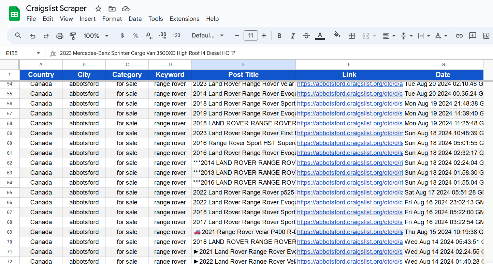

# CraigsList Scraper UI App

Scraper App that connects with your google sheet and scrap any post for the given keyword inside give category. It only searches in US and Canada for now. Pagination is handled properly no record can be missed.

## Running from Terminal

Make sure python and pip is properly installed.

#### Prerequisites

- Google Sheet with name **"Craigslist Scraper"** worksheet name **"Sheet1"**
- Google Cloud Console Account and APIs enabled for google sheet and google drive
- Cloud Console Service Account and JSON key file for the service account
- Share the google sheet with the service account email address
- Rename the JSON key file to **"credentials.json"** and store in the same directry as of script.
- Lates version of **Google Chrome** needs to be installed for selenium scraping

#### Install the requirements

```bash
1.  pip install -r requirements.txt
```

#### Run The Script

```bash
2.  python '.\CraigsList Scraper.py'
```

#### Building Executable EXE file for Standalone Running

Download my prebuilt exe file from releases, do the Prerequisite steps and run the program

**or**

Build your own executable file. This will build executable file in the dist folder of your project.

```bash
3.  pyinstaller --onefile --windowed '.\CraigsList Scraper.py'
```

## Demo and Screenshots

Upon running the app. It sends initial request to main CraigsList website to fetch all the data from Country Page and populate states of selected in country in the UI.

- Select Country from dropdown
- Select 1 or Multiple states
- Clock Load Cities Button
- Select 1 or Multiple Cities.
- Type Keyword eg. **car** and Category eg. **for sale**. Dont worry about text case.
- Keyword can be anything that you are looking for but categories are select few. Visit https://www.craigslist.org/about/sites or https://londonon.craigslist.org/ to see what categories are present in the cities. Eg **for sale, gigs etc**
- Click **Start Button** and now the scrapper will start connecting to your google sheet, search for the keywords in all the selected cities and category and then save the response of each result in google sheet file.



